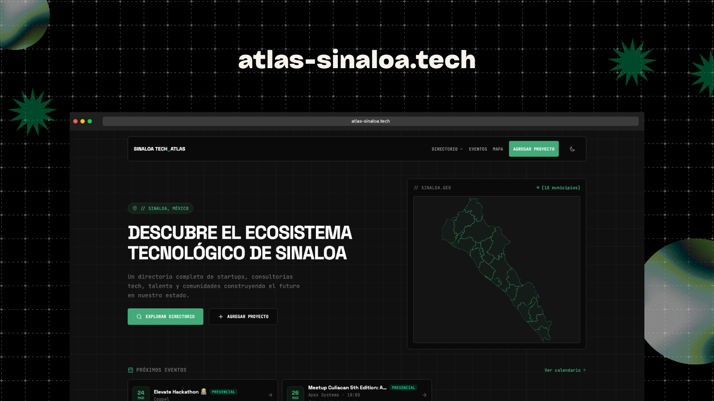

<div align="center">
  
  <h1>Atlas Tech</h1>
  <p><strong>Directorio del ecosistema tecnologico de Sinaloa</strong></p>

<a href="https://atlas-sinaloa.tech"></a>

<br />


</div>

---

Plataforma web construida con Next.js y Payload CMS para gestionar el directorio de startups, empresas, comunidades y personas del ecosistema tech de Sinaloa.

Este repositorio cubre un solo estado por ahora, pero esta diseñado para que cualquier persona pueda hacer fork y crear el atlas de su propio estado.

## Inicio rapido

```bash
pnpm install
cp .env.example .env      # configura tus variables
pnpm dev                   # servidor de desarrollo en localhost:3000
```

El panel de administracion de Payload esta disponible en `/admin`.

## Como funciona la publicacion de contenido

1. Un usuario se registra en el sitio (Google OAuth o email/password via better-auth)
2. Desde su dashboard, envia un registro a traves del formulario wizard (startup, empresa, comunidad, persona, etc.)
3. El registro se guarda como **borrador** en la base de datos via Payload
4. Un moderador revisa el registro desde el panel de admin (`/admin`) y lo publica o lo rechaza con una nota
5. Al publicarse, el contenido aparece automaticamente en el directorio publico

Las imagenes (logos, portadas) se suben a almacenamiento S3 compatible (Cloudflare R2 en produccion, MinIO en desarrollo local).

## Variables de entorno

Copia `.env.example` y configura segun tu entorno:

| Variable | Descripcion |
|---|---|
| `DATABASE_URI` | Conexion a PostgreSQL (Neon, local, etc.) |
| `PAYLOAD_SECRET` | Secret para Payload CMS |
| `S3_*` | Credenciales de almacenamiento S3 (R2 o MinIO) |
| `MEDIA_URL` | URL publica para servir imagenes |
| `NEXT_PUBLIC_SITE_URL` | URL del sitio |
| `BETTER_AUTH_SECRET` | Secret para autenticacion |
| `GOOGLE_CLIENT_ID/SECRET` | OAuth de Google (opcional) |
| `APPLE_*` / `GOOGLE_WALLET_*` | Generacion de wallet passes (opcional) |

## Docker

El `Dockerfile` multi-stage construye la app en 3 fases:

1. **deps** — instala dependencias con `pnpm install --frozen-lockfile`
2. **builder** — genera el import map de Payload, ejecuta migraciones de base de datos, y construye la app Next.js
3. **runner** — imagen minima de produccion con el output standalone de Next.js

```bash
docker build --build-arg DATABASE_URI="postgresql://..." -t atlas-tech .
docker run -p 3000:3000 --env-file .env atlas-tech
```

> La base de datos debe estar accesible durante el build para que las migraciones se ejecuten.

## Mapas

Los mapas geograficos utilizan archivos tipo **AGEM** (Area Geoestadistica Municipal) de INEGI:

https://www.inegi.org.mx/temas/mg/#mapas

Coloca el archivo descargado en `public/topo/`.

## Crea tu propio atlas

1. Haz fork de este repositorio
2. Configura tu base de datos PostgreSQL y variables de entorno
3. Descarga los mapas AGEM de tu estado desde INEGI
4. Despliega con Docker o en cualquier plataforma compatible con Next.js
